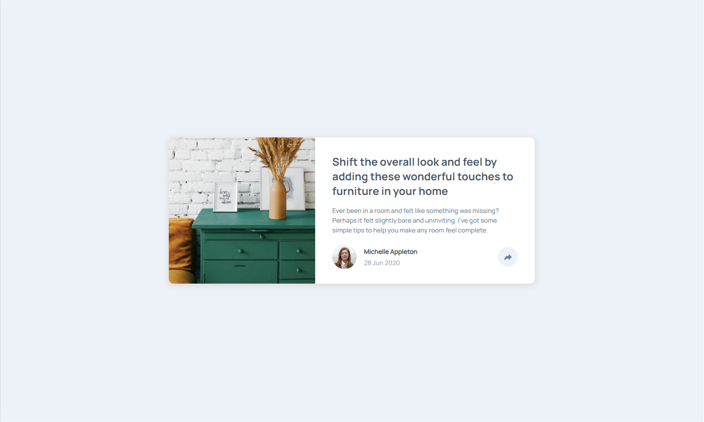
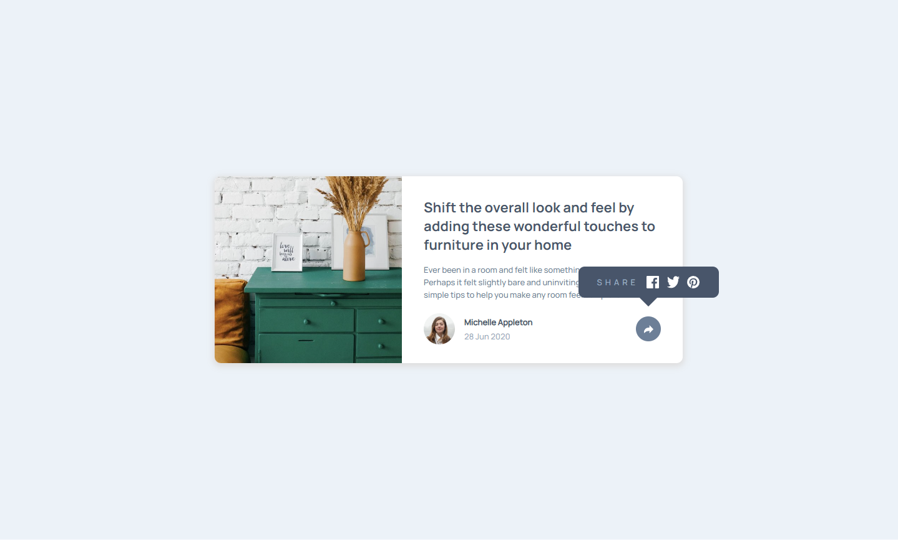
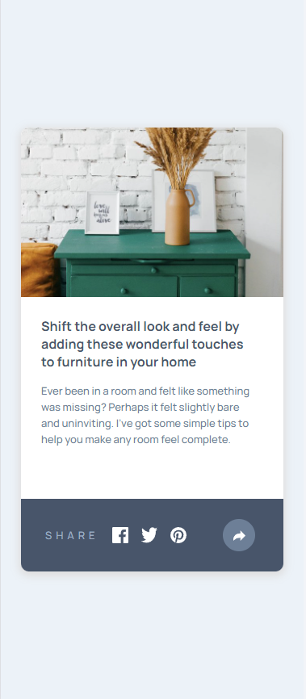

# Frontend Mentor - Article preview component solution

This is a solution to the [Article preview component challenge on Frontend Mentor](https://www.frontendmentor.io/challenges/article-preview-component-dYBN_pYFT). Frontend Mentor challenges help you improve your coding skills by building realistic projects. 

## Table of contents

- [Overview](#overview)
  - [The challenge](#the-challenge)
  - [Screenshot](#screenshot)
  - [Links](#links)
- [My process](#my-process)
  - [Built with](#built-with)
  - [What I learned](#what-i-learned)
  - [Useful resources](#useful-resources)
- [Author](#author)
- [Acknowledgments](#acknowledgments)

## Overview

### The challenge

Users should be able to:

- View the optimal layout for the component depending on their device's screen size
- See the social media share links when they click the share icon

### Screenshot

## Desktop Design

## Active Desktop Design

## Mobile Design

### Links

- Live Site URL: [Article Preview](https://rkendall300.github.io/article-preview)

## My process

### Built with

- Semantic HTML5 markup
- CSS custom properties
- Flexbox
- [React](https://reactjs.org/) - JS library

### What I learned

The biggest learning step for this project was of course the pop-up sharing bar. I've never had a pop-up type of section in any project before, so learning how to do it was a bit difficult and honestly frustrating at times. For the desktop design, it was not too hard to figure out, and my friend Eric helped me out with setting the positions properly to allow for it to "float" on top of the card. Using [position: relative] on the share icon and [position: absolute] was the proper way to do it, and after learning more about positioning, I am pretty comfortable with this moving forward.

However, the positioning on the mobile design was a much different story. I put the pop-up sharing bar inside the element that contained the share icon, so the positioning in the desktop version would be easy, but that was much more difficult in the mobile version since the pop-up needed to essentially cover the entire footer. So, modifying the absolute positioning to cover the footer wasn't too difficult, it just took a bit to get correct, but the biggest problem I had was getting the share-icon background to be on the same z-index as the pop-up share bar. Because of how the HTML elements are laid out, with the share bar being inside of the parent div of the share-icon, the actual background that I was using for the share-icon was not able to get moved up to the same z-index. After reading a lot of articles online trying to figure out if a parent could appear above a child in z-index, it did not seem possible and I would have to reorganize the code completely and redo both desktop and mobile versions.

Finally, what I ended up actually doing was essentially cheating the code by using the small triangle element that was originally just made for the desktop design and modifying it to be the same size, color, and appearance as the share-icon background. This allowed me to copy the parent element's original properties while the triangle element was actually a child. This is probably not something that I would use in the future, but was a huge relief for this project because I didn't have to redo the share bar.

### Useful resources

- [Z-index Help](https://www.freecodecamp.org/news/4-reasons-your-z-index-isnt-working-and-how-to-fix-it-coder-coder-6bc05f103e6c/) - This helped me learn more about z-indexes, and the very finicky situations in which it can become difficult. The main lesson I learned from it was to attempt to avoid z-indexes by using different position properties, except for the times that z-index is necessary.

## Author

- Frontend Mentor - [@rkendall300](https://www.frontendmentor.io/profile/rkendall300)

## Acknowledgments

Thanks to my friend Eric for the help with this!
